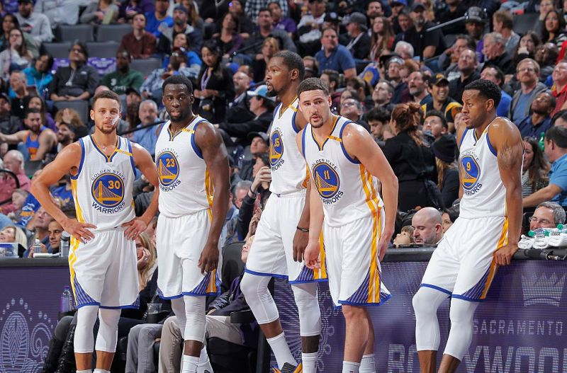
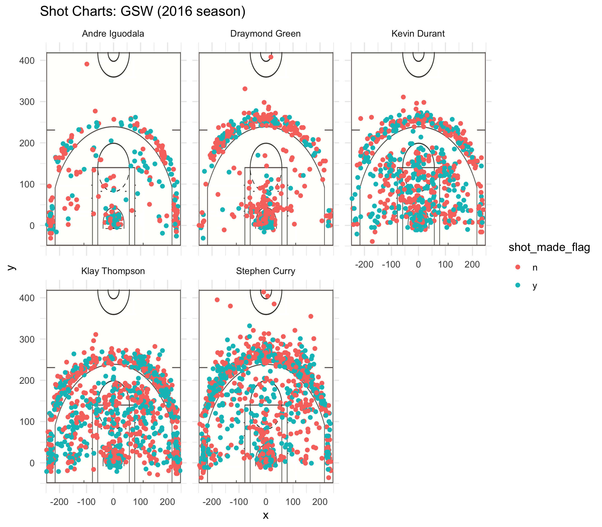

workout01
================
Jiaxin Chen
3/2/2019

#### **Introduction**

| 2016-17 Golden State Warriors season |
|--------------------------------------|
| NBA Champions                        |
| Conference champions                 |
| Division champions                   |
| Record: 67-15 (.817)                 |
| Playoff finish: NBA Champions        |

The 2016-17 NBA season was one of the most exciting seasons in National Basketball Association(NBA) history. At the same time, the Golden State Warriors became the greatest team in the NBA history. It was the fifth NBA Championship that the Warriors won. Their record of 67-15 became the best postseason record in NBA history as well. The warriors proved the world how to make impposible possible.

#### **Motivation**

What makes the Golden State Warriors so successful in the 2016-17 NBA season? Their perfect teamwork played an important role in their success. In the meanwhile, each of the Warriors was doing an amazing job as well. We are going to introduce the best five players of the Golden State Warriors: Stephen Curry, Kevin Durant, Klay Thompson, Draymond Green, and Andre Iguodala.

 L to R: Stephen Curry, Draymond Green, Kevin Durant, Klay Thompson and Andre Iguodala of the Golden State Warriors

#### **background**

| Stephen Curry                    |
|----------------------------------|
| Position: Point guard (PG)       |
| Born: March 14, 1988             |
| Listed Height: 6 ft 3 in (1.91m) |
| Listed Weight: 190 lb (86kg)     |

| Kevin Durant                     |
|----------------------------------|
| Position: Small forward (SP)     |
| Born: September 29, 1988         |
| Listed Height: 6 ft 9 in (2.06m) |
| Listed Weight: 240 lb (109 kg)   |

| Klay Thompson                    |
|----------------------------------|
| Position: Shooting guard (SG)    |
| Born: February 8, 1990           |
| Listed Height: 6 ft 7 in (2.01m) |
| Listed Weight: 215 lb (98kg)     |

| Draymond Green                   |
|----------------------------------|
| Position: Power forward          |
| Born: march 4, 1990              |
| Listed Height: 6 ft 7 in (2.01m) |
| Listed Weight: 230 lb (104 kg)   |

| Andre Iguodala                                     |
|----------------------------------------------------|
| Position: Shooting guard (SG) / Small forward (SF) |
| Born: January 28, 1984                             |
| Listed Height: 6 ft 6 in (1.98m)                   |
| Listed Weight: 215 lb (98kg)                       |

#### **Data and Analysis**

Now Let's take a deeper look at the performance of Andre Iguodala, Draymond Green, Kevin Durant, Klay Thompson, and Stephen Curry by the data.

**Shot Charts**

Below is the shot charts by player.

    ## 
    ## Attaching package: 'dplyr'

    ## The following objects are masked from 'package:stats':
    ## 
    ##     filter, lag

    ## The following objects are masked from 'package:base':
    ## 
    ##     intersect, setdiff, setequal, union

**2PT Effective Shooting Percentage by Player**

    ## # A tibble: 5 x 4
    ##   name           total  made perc_made
    ##   <fct>          <int> <int>     <dbl>
    ## 1 Andre Iguodala   210   134      63.8
    ## 2 Kevin Durant     643   390      60.7
    ## 3 Stephen Curry    563   304      54.0
    ## 4 Klay Thompson    640   329      51.4
    ## 5 Draymond Green   346   171      49.4

**3PT Effective Shooting Percentage by Player**

    ## # A tibble: 5 x 4
    ##   name           total  made perc_made
    ##   <fct>          <int> <int>     <dbl>
    ## 1 Klay Thompson    580   246      42.4
    ## 2 Stephen Curry    687   280      40.8
    ## 3 Kevin Durant     272   105      38.6
    ## 4 Andre Iguodala   161    58      36.0
    ## 5 Draymond Green   232    74      31.9

**Overall Effective Shooting Percentage by Player**

    ## # A tibble: 5 x 4
    ##   name           total  made perc_made
    ##   <fct>          <int> <int>     <dbl>
    ## 1 Kevin Durant     915   495      54.1
    ## 2 Andre Iguodala   371   192      51.8
    ## 3 Klay Thompson   1220   575      47.1
    ## 4 Stephen Curry   1250   584      46.7
    ## 5 Draymond Green   578   245      42.4

**Stephen Curry**: Stephen Curry has been named the NBA Most Valuable Player (MVP) twice. He won three NBA championships with the Warriors. Playing at the point guard position, Stephen Curry is very good at shooting. He has approximately 54% of the 2PT effective percentage, approximately 41% of the 3PT effective percentage, and approximately 47% of the overall effective percentage.

**Kevin Durant**: Kevin Durant is one of the great basketball players in the NBA history. He has won two NBA championships. He is very good at shooting. Kevin Durant has the highest overall effective percentage among them, approximately 54%. Also, he has a very high 2PT effective percentage, approximately 60% and 39% of 3PT effective percentage.

**Klay Thompson**: Klay Thompson is credited as one of the greatest shooters in NBA history. He has the highest 3PT effective percentage among them, approximately 42%. Also, He has the 51% of the 2PT effective percentage and 47% of the overall effective percentage.

**Graymond Green**: Graymond Green played at the power forward position. He also won three NBA championships. Compared to other four players, Graymond Green has the lowest effective percentage. He has approximately 49% of the 2PT effective percentage, approximately 32% of the 3PT effective percentage, and approximately 42% of the overall effective percentage.

**Andre Iguodala**: Andre Iguodala is an excellent 2-point shooter. He had the highest 2PT effective percentage, approximately 64% among them. Compared to his 2PT effective percentage, he has a relative low 3PT effective shooting percentage, approximately 36%. However, Andre Iguodala had a very good overall effective percentage, approximately 52%.

#### **discussion and conclusion**

In conclusion, we analyzed the player's performance by three aspects of effective percentage which are 2PT effective percentage, 3PT effective percentage, and overall efective percentage. Based on the effective percentages, it is obvious to understand their abilities of shooting. The Golden State Warriors had done an amazing job in the 2016-17 NBA season. Not only the five players above (Stephen Curry, Kevin Durant, Klay Thompson, Draymond Green, and Andre Iguodala) were doing a great job, but every player of the Golden State Warriors was excellent and talented. Excellent teamwork was the key point for the success of Golden State Warriors in the 2016-17 NBA season.

#### **Reference**

[2016–17 Golden State Warriors season](https://en.wikipedia.org/wiki/2016–17_Golden_State_Warriors_season#Records)

[Stephen Curry](https://en.wikipedia.org/wiki/Stephen_Curry)

[Kevin Durant](https://en.wikipedia.org/wiki/Kevin_Durant)

[Klay Thompson](https://en.wikipedia.org/wiki/Klay_Thompson)

[Draymond Green](https://en.wikipedia.org/wiki/Draymond_Green)

[Andre Iguodala](https://en.wikipedia.org/wiki/Andre_Iguodala)
